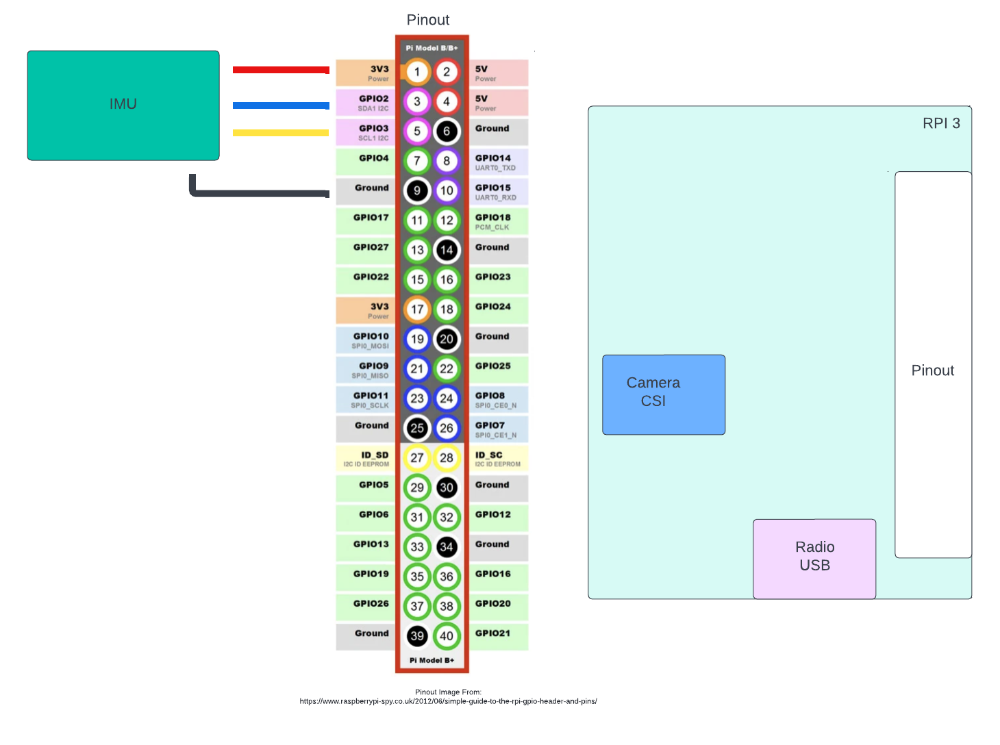

# F´ System Reference: A Reference Project Using an Open-Source Flight Software Framework

## Table of Contents 
1. [About The Project](#about-the-project)
2. [Getting Started](#getting-started)
3. [Device Wiring](#Device-Wiring)

# About The Project
The purpose of this project is to provide an example embedded software application that uses the F´ framework. 
The System Reference consists of several subsystems: 
- Payload
- Guidance Navigation and Control (GNC)
- Communication 

## Built With
- [F Prime](https://github.com/nasa/fprime) 
- [ARM GNU Toolchain](https://developer.arm.com/downloads/-/arm-gnu-toolchain-downloads)
- [libcamera](https://www.raspberrypi.com/documentation/computers/camera_software.html)

# Getting Started

## Requirements 
The system reference depends on several items, before the user attempts to clone the project they should ensure that they have the listed requirements below before proceeding. 

Requirements:
1. Linux OS
2. libcamera
   - For libcamera dependencies, please see the list [here](https://github.com/raspberrypi/libcamera#dependencies). Ensure that the required dependencies are installed before building libcamera (steps for building libcamera are in the [Setup libcamera](#build-libcamera)) section below.
   - In addition, will need pkg-config installed
3. F Prime Environment
   - Python virtual environment with fprime-fpp, fprime-tools, and fprime-gds installed
4. Cross-Compilation tools for ARM
   - For steps on how to install all the dependencies required for cross-compiling for different architectures, see the [F´ Cross-Compilation Setup Tutorial](https://github.com/nasa/fprime/blob/devel/docs/Tutorials/CrossCompilationSetup/CrossCompilationSetupTutorial.md).
5. Raspberry Pi with Bullseye OS
   - In order to run the System Reference with libcamera, Bullseye OS is required. In addition, the firmware version may need to be upgraded in the event the system is configured to use the legacy camera stack.


## Clone the F´ System Reference
```
git clone https://github.com/fprime-community/fprime-system-reference.git
```

## Setup libcamera
libcamera is a library that provides a C++ API to applications that enables them to configure Raspberry Pi cameras and request image frames. The steps below cover how to build libcamera (for both native linux and ARM Linux), as well as how to build the System Reference with libcamera included.

### Build libcamera
In order to run the camera subsystem, libcamera first has to be built. See the [Compiling libcamera for Native Linux](./docs/integration/camera/compiling-libcamera.md#compiling-libcamera-for-native-linux) guide for steps on how to build libcamera for native Linux. Otherwise, if you are looking to run the System Reference on ARM Linux, see the [Compiling libcamera for ARM Linux](./docs/integration/camera/compiling-libcamera.md#cross-compiling-libcamera-for-arm-linux) guide in order to cross-compile the library.

## Building the System Reference

### Building the System Reference with libcamera
Once the libcamera library is built, you can build the System Reference with libcamera included. This is required in order to run the camera subsystem, without doing so, the System Reference will not detect a camera and configure, process, or save images. For steps on how to build the System Reference with libcamera, see the guide [here](./docs/integration/camera/building-system-ref-with-libcamera.md).

### Building the System Reference (no libcamera)
To build the System Reference without libcamera, in a terminal run the below commands.

Note: Without libcamera, the System Reference will not detect a camera and configure, process, or save images.

For Native Linux:
```bash
fprime-util generate
fprime-util build
```

If compiling for ARM Linux, see the steps in the [Cross Compilation Tutorial](https://github.com/nasa/fprime/blob/devel/docs/Tutorials/CrossCompilationSetup/CrossCompilationTutorial.md).


## Upload to the Raspberry Pi
To run the ground system:
```
fprime-gds -n --dictionary build-artifacts/raspberrypi/dict/SystemReferenceTopologyAppDictionary.xml
```

To copy the binary to the Raspberry Pi 
```
scp build-artifacts/raspberrypi/bin/SystemReference pi@<YOUR RASPBERRY PI IP ADDRESS>:~
```
#### Running System Reference on the Raspberry Pi
After logging into the Raspberry Pi via SSH, you can run the Ref deployment as follows: 
```
./SystemReference -a <ground system ip> -p 50000
```

## Examples
- [Camera Component Tutorial](./docs//integration/camera/example.md) - Tutorial on how to capture frames, downlink the image data to the ground, and how to process it as PNG or JPEG.

### RPI Wiring

