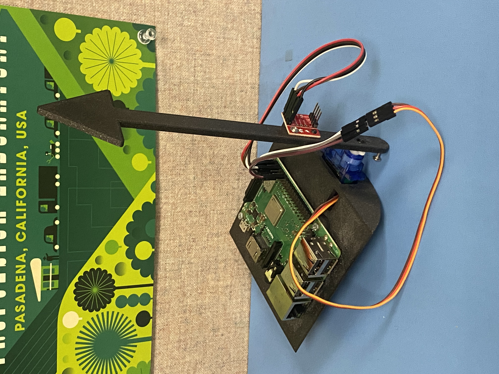
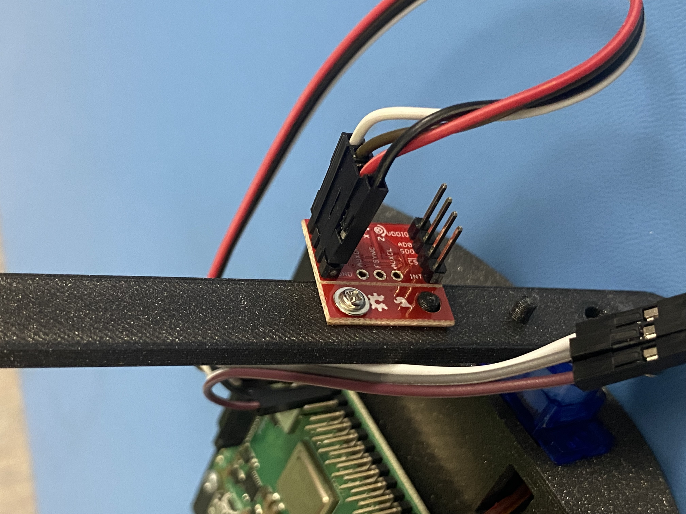

# Linux PWM Driver

## Description 

The actuator component is designed to demonstrate a
continuous feedback loop between a sensor and 
an actuator. In this case, the sensor is an IMU
and the actuator a servo. The goal of the actuator 
component is to point an arrow (of F' logo) directly upwards.
In practice, the IMU is mounted on the arrow, the arrow 
is mounted to the servo, and the servo is attached to 
some base (or held).

## For Best Results 

For best results, ensure that the IMU is driven around of above 
10Hz. Adjust gain and vertCondition as need to tune this device because
each servo is a little different and so is each IMU.

## Design  

Two main things take places in the actuator component.
1. Data from the IMU's Y-vector is taken into an array,
or "window", and averaged to limit noise.
2. IMU data is used to determine how far the arrow is 
from vertical, and an adjustment is made. Roughly speaking,
a P-controller is used to point the arrow vertically. 

## Hardware
1. Raspberry pi
2. SG90 servo 
3. 3D printed structure (optional, but encoraged)
4. F' logo or arrow
5. IMU 

## Assembly

Below are a couple images of the of actuator component and 3D structure.

The RPI is attached to the 3D printed structure using small,
self tapping screws. The servo is simply placed into the 
servo hole in the structure. The arrow is attached to the servo 
using two servo screws. The IMU is mounted to the arrow 
using one 3D printed nub (on the arrow) and self tapping screw.

**IMPORTANT:** When mounting the IMU, you must make sure that 
when the arrow is pointed straight up that the IMU accelerometer 
data reads something very close to [0,1,0]. The IMU data, 
formatted [x,y,z] in the imu telemetry channel, ***must*** indicate 
that the X vector is near zero, and the Y vector is near one 
when the arrow is pointed straight up; the algorithm depends on this.

## Pinouts

Raspberry Pi | SG90 Servo 
* 2  | Red (5V)
* 6  | Brown (GND)
* 12 | Orange (PWM)

Rasberry Pi | MPU9250 IMU 
* 1  | Vdd (3.3V)
* 9  | GND 
* 3  | SDA
* 5  | SCL 

[Pinout Diagram](https://www.raspberrypi.com/documentation/computers/raspberry-pi.html)

## Improvements 

Here are a few things that would make the actuator better.

* Gain and Vertical Condition as parameters.

* Telememtry stating whether arrow is pointed up. 

* Servo manager that allows actuator to write angles, not on time. 

* Move windowing to another component 

* Fix activate problem, the system does not turn on until the user sends ACTIVATE(off) then  ACTIVATE(on).

