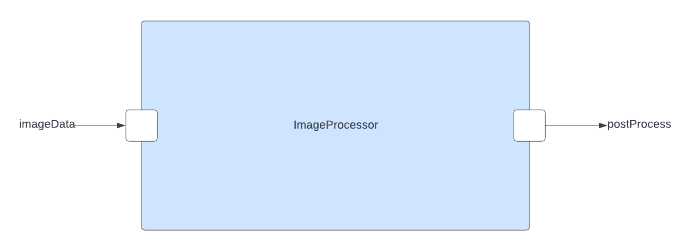

\page PayloadCameraComponent Payload::ImageProcessor Component
# Payload::ImageProcessor (Active Component)

## 1. Introduction
`Payload::ImageProcessor` is an F' active component that processes raw images captured from the camera component. 
The component uses opencv to convert raw images to either a JPG or PNG format. 

## 2. Requirements
| Requirement                | Description                                                                        | Verification Method |
|----------------------------|------------------------------------------------------------------------------------|---------------------|
| PAYLOAD-IMAGEPROCESSOR-001 | The `Payload::ImageProcessor` shall convert raw images to JPG format               | Unit-Test           |
| PAYLOAD-IMAGEPROCESSOR-002 | The `Payload::ImageProcessor` shall convert raw images to PNG format               | Unit-Test           |
| PAYLOAD-IMAGEPROCESSOR-003 | The `Payload::ImageProcessor` component shall send image data to the buffer logger | Inspection          |

## 3. Design
The diagram below shows the `Camera` component.

### 3.2 Ports
`ImageProcessor` has the following ports:

| Kind          | Name          | Port Type       | Usage                                                                        |
|---------------|---------------|-----------------|------------------------------------------------------------------------------|
| `output`      | `postProcess` | `Fw.BufferSend` | Port that outputs images that have been converted to a specified file format |
| `async input` | `imageData`   | `ImageData`     | Port that takes in raw image data                                            |
**Note:** standard event, telemetry, and command ports are not listed above.

### 3.3. State
`ImageProcessor` maintains the following state:

| Name           | Type                 | Initial Value | Usage                                                      |
|----------------|----------------------|---------------|------------------------------------------------------------|
| `m_fileFormat` | `std::string`        | nullptr       | pointer to  file format the raw image will be converted to |
| `m_PNG`        | ` const std::string` | ".png"        | png file format string                                     |
| `m_PNG`        | ` const std::string` | ".jpg"        | jpg file format string                                     |

### 3.4. Handlers

#### 3.4.1 imageData
The `imageData` port handler does the following:
1. Converts raw image data to a matrix of type `cv::Mat`
2. Encodes the matrix to a specific file format 
3. Copies the processed image to a buffer and sends it to the buffer logger
**Note:** Due to the use of the opencv library, this function uses dynamic memory 

#### 3.4.2 setFormat
The `setFormat` command handler does the following:
1. Takes a command to set the file format of the raw image to be processed

## 4. Sequence Diagram

