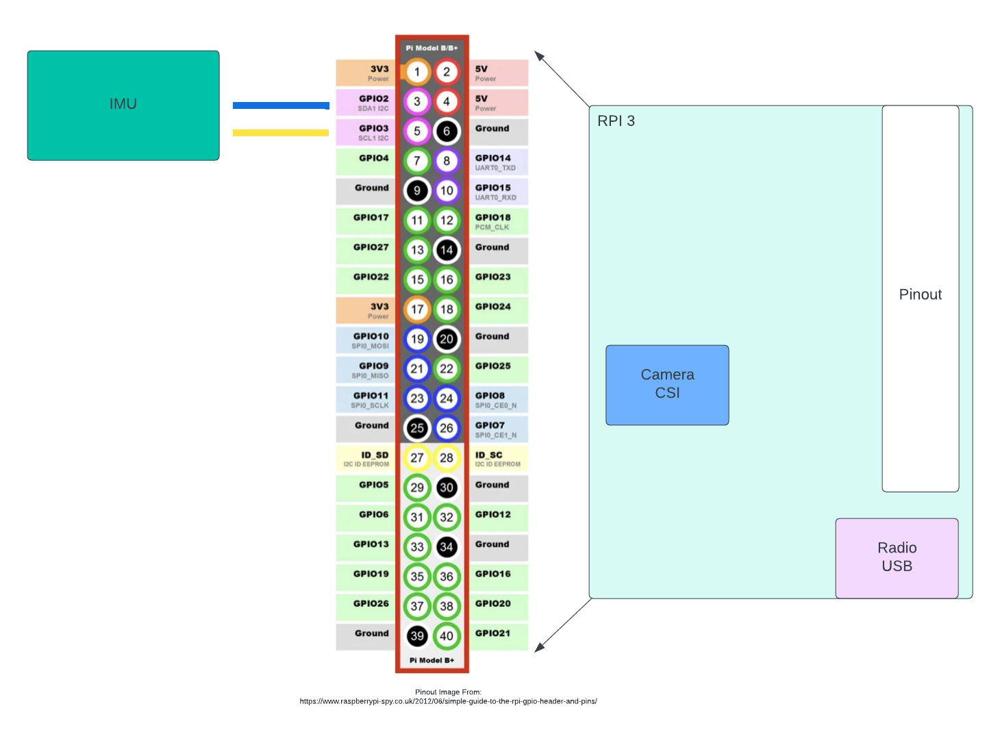

# F´ System Reference: A Reference Project Using an Open-Source Flight Software Framework

## Table of Contents 
1. [About The Project](#About-The-Project)
3. [Getting Started](#Getting-Started)
4. [Usage](#Usage)
5. [Device Wiring](#Device-Wiring)

## About The Project
The purpose of this project is provide an example embedded software application that uses the F´ framework. 
The System Reference consists of several subsystems: 
- Payload
- Guidance Navigation and Control (GNC)
- Communication 

## Built With
- [OpenCV](https://github.com/opencv/opencv)
- [F Prime](https://github.com/nasa/fprime) 
- [RPI Cross Compile Tools](https://github.com/raspberrypi/tools)

## Getting Started

### Requirements 
The system reference depends on several items, before the user attempts to clone the project they should ensure that they 
have the listed requirements below before proceeding. 

Requirements:
1. Linux OS
2. OpenCV
3. F Prime Environment
4. Cross compilations tools for the Raspberry Pi

Information on how to install OpenCV and set up the F Prime environment can be found in the built with section

### Build OpenCV
To build OpenCV in order to run the camera subsystem in this project the user will need to
first create a build directory, make the build directory current and then run the following command: 

```
cmake -D CMAKE_BUILD_TYPE=RELEASE -DCMAKE_TOOLCHAIN_FILE=<path to fprime-system-reference>/fprime/cmake/toolchain/raspberrypi.cmake -DBUILD_SHARED_LIBS=OFF -DBUILD_TESTS=ON -DBUILD_DOCS=OFF -DWITH_V4L=ON -DWITH_LIBV4L=ON -DCMAKE_INSTALL_PREFIX=opt/ -DOpenCV_DIR=/Payload/build/ -DBUILD_SHARED_LIBS=OFF ../opencv/```
```
Then run make in the build directory: 
```
make
```
More details on how to set up cross compilation for OpenCV can be found [here](https://docs.opencv.org/4.x/d0/d76/tutorial_arm_crosscompile_with_cmake.html).

To generate fprime with OpenCV use the following command:
```
fprime-util generate -DSYSTEM_REFERENCE_OPENCV_PATH=/home/pel/fprime-system-reference/SystemReference/Payload/build/opt/
```
**Note**
The command to build OpenCV for unit tests is slightly different. Therefore, OpenCV will need to be built again using:
```
cmake -D CMAKE_BUILD_TYPE=RELEASE -DBUILD_TESTS=ON -DBUILD_DOCS=OFF -DWITH_V4L=ON -DWITH_LIBV4L=ON  -DOpenCV_DIR=/Payload/build/ -DBUILD_SHARED_LIBS=OFF ../opencv/
```
### Clone
```
https://github.com/fprime-community/fprime-system-reference.git
```

## Usage
The steps to run the system reference project follows similar steps that are described in the F prime cross-compilation
tutorial that can be found [here](https://nasa.github.io/fprime/Tutorials/CrossCompilation/Tutorial.html).

#### Upload to the Raspberry Pi
To run the ground system:
```
fprime-gds -n --dictionary build-artifacts/raspberrypi/dict/SystemReferenceTopologyAppDictionary.xml
```

To copy the binary to the Raspberry Pi 
```
scp build-artifacts/raspberrypi/bin/SystemReference pi@<YOUR RASPBERRY PI IP ADDRESS>:~
```
#### Running System Reference on the Raspberry Pi
After logging into the Raspberry Pi via SSH, you can run the Ref deployment as follows: 
```
./SystemReference -a <ground system ip> -p 50000
```
### Device Wiring


