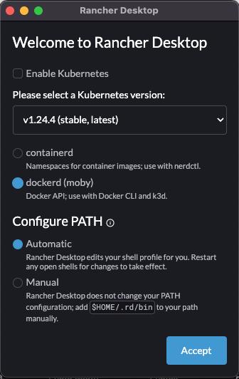

# IMU Exercise Appendix II: Installing Rancher Desktop and the F´ ARM Container

Some users may with to run cross-compilers within docker to minimize the impact of those tools on their systems.
Macintosh users will be required to use docker as the ARM/Linux cross-compilers are not available natively for macOS and
simple virtualization of a Linux box is no longer practical since the introduction of M1 hardware.

## Rancher Desktop Setup

Rancher Desktop is an alternative to Docker Desktop that allows users to run docker containers directly on their desktop
computer. It does not require a license for use like Docker Desktop does and also supports both intel and M1 based
Macintosh computers.

**Note:** non-Macintosh users are advised to follow the instructions for their operating system.

To install [Rancher Desktop](https://rancherdesktop.io/), follow the instructions for your operating system. When
presented with a "Welcome to Rancher Desktop" dialog, choose the following settings:
1. Disable Kubernetes
2. Select `dockerd`
3. Configure PATH Automatic



Ensure that Rancher Desktop is running and that the VM it uses has been started. You can confirm this by ensuring no
pop-ups nor progress bars are visible in Rancher Desktop's main window as shown below.


Once this is done, users can install the container by running the following command in their host terminal. It should
complete without errors.

```bash
docker pull nasafprime/fprime-arm:devel
```

## Running The Container

In order to run the commands provided by the docker container (i.e. the cross-compilers), users must start the container
and attach to a terminal inside. This should be done **after** the prerequisite
[step 2](./prerequisites.md#step-2:-cloning-the-f´-system-reference) so that we can ensure our cloned code is shared
with the container.

The command to run a terminal in the docker container is:
```bash
cd ~/fprime-system-reference
docker run --net host -itv "`pwd`:/project" nasafprime/fprime-arm:devel
```

> Anytime Macintosh users run cross-compilation commands, they **must** do so in a terminal inside the docker container.