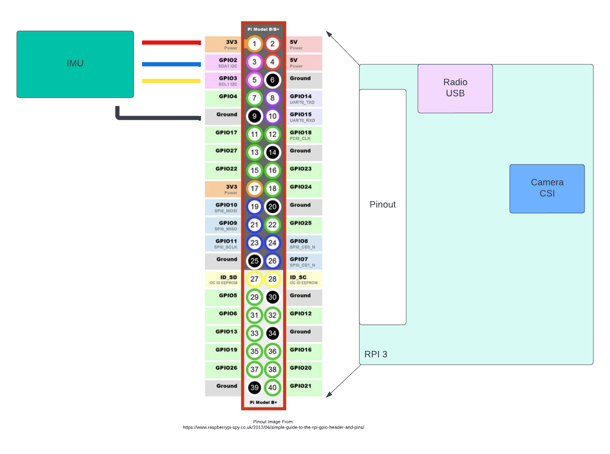

# IMU Exercise: Hardware Setup

In order to complete the lab exercise we need to wire-up hardware. In this exercise may use the Raspberry PI 3 or the
Odroid M1 depending on the hardware supplied to the class.  The IMU will be the MPU-6050 IMU. The IMU uses I2C to
communicate and should be connected to the computers I2C pins as shown below

## Wiring Specification

The IMU should be connected using the IMU wiring harness. The black connector connects to the IMU PCB and the jumper
wires connect to the PI.  The blue wire is the I2C data line and should be connected to the SDA1 pin of the PI (pin 3).
The yellow line is the I2C clock to be connected to SCL1 on the PI (pin 5).  Red is power (3.3V) and black is ground
(pin 1 and pin 9)

These connections can be seen on the following wiring diagram. **Note:** in this lab exercise we neither use the radio,
nor the camera.  These interfaces can safely be ignored for the lab exercise.

### Odroid M1

The Odroid M1 will use the I2C-0 bus and is shown in the wiring diagram below.

### RPI Wiring

The RPI will use the I2C-1 bus and is shown in the wiring diagram below.

## Additional Resources
- [MPU-6050 IMU](https://learn.adafruit.com/mpu6050-6-dof-accelerometer-and-gyro)

## Next Steps
- [Requirements and Design](./requirements-and-design.md)