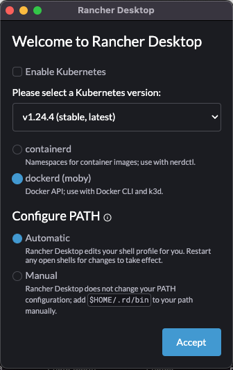

# Introduction

This document will describe the use of the F´ system reference as a reference for the flight software workshop. We will
explore flight software through the lens of F´ and this exercise. In the exercise, we will integrate the
[MPU-6050 IMU](https://learn.adafruit.com/mpu6050-6-dof-accelerometer-and-gyro) into our F´ project with the goal of
generating telemetry.

Please try to cover the prerequisite section (below) before attending the class. The other sections we'll cover during
the exercise portion of the class.

- [Hardware Setup](./hardware.md)
- [Requirements and Design](./requirements-and-design.md)
- [Component Implementation](./component-implementation.md)
- [Unit Testing](./unit-testing.md)
- [Topology Integration and Testing](./topology-integration.md)
- [Appendix I: Code Snippets](./appendix-1.md)

## Prerequisites

In order to run code on the reference hardware, we need the ability to cross-compile for the given target architecture.
Since students may be running any number of different laptops, we have placed the tools needed to cross-compile in a
Docker container, and we will run the class using this docker container. This means each student's laptop needs to be
setup to run Docker and our container.

**Note:** it is entirely possible to run cross-compilation on a Linux laptop without docker by installing F´ as
discussed in the F´ [installation guide](https://nasa.github.io/fprime/INSTALL.html) and installing the 32-bit ARM gcc
package. However, it would be on the attendee to ensure this is set up and working prior to the class as instructor time
to help is limited.

In order to set this up, follow these steps:

1. Ensure that "git" is installed on your computer
2. Install [Rancher Desktop](https://rancherdesktop.io/) or another software to running docker containers locally
   1. When presented with a "Welcome to Rancher Desktop" dialog, choose the following settings:
      1. Disable Kubernetes
      2. Select `dockerd` 
      3. Configure PATH Automatic

   
3. Pull the F´ Docker Raspberry PI Docker Container
   1. Run `docker pull nasa/fprime/fprime-raspi:devel`
   2. Check docker container: `docker run -it nasa/fprime/fprime-raspi:devel`
4. Clone the F´ System Reference
   1. Run `git clone https://github.com/fprime-community/fprime-system-reference`
   2. Checkout the "XYZ" branch `git checkout XYZ`
5. Test the docker container and code
   1. To start the container run `docker run --net host -it -v /path/to/fprime:/project nasa/fprime/fprime-raspi:devel`
   2. Generate an F´ build `cd SystemReference` then `fprime-util generate`
   3. Build F´ `fprime-util build`
   4. Run F´ GDS `fprime-gds` and open a browser to `https://localhost:5000`
   5. You should now see a GUI with a green circle in the upper right corner.  Congratulations, F´ is running.

## TODO, callout running the docker container, generating, and building

## Next Steps

- [Hardware Setup](./hardware.md)